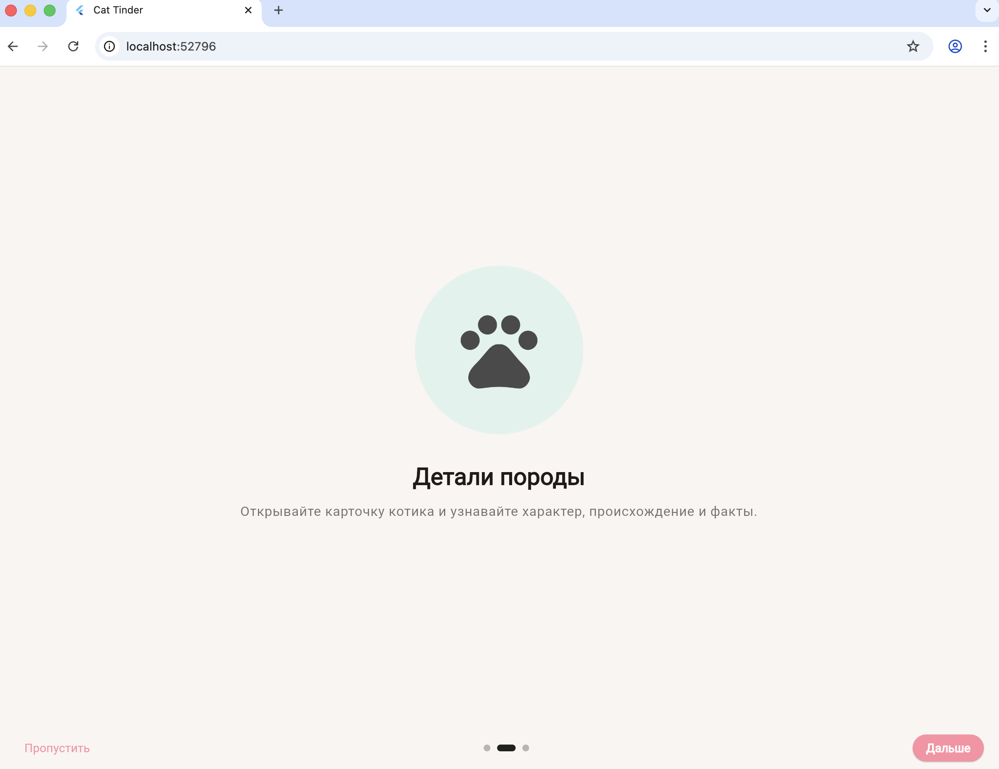
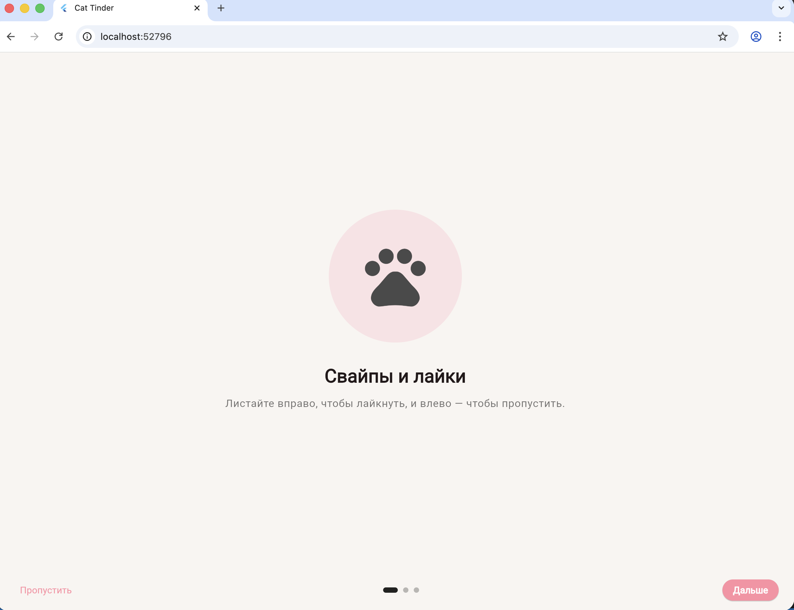
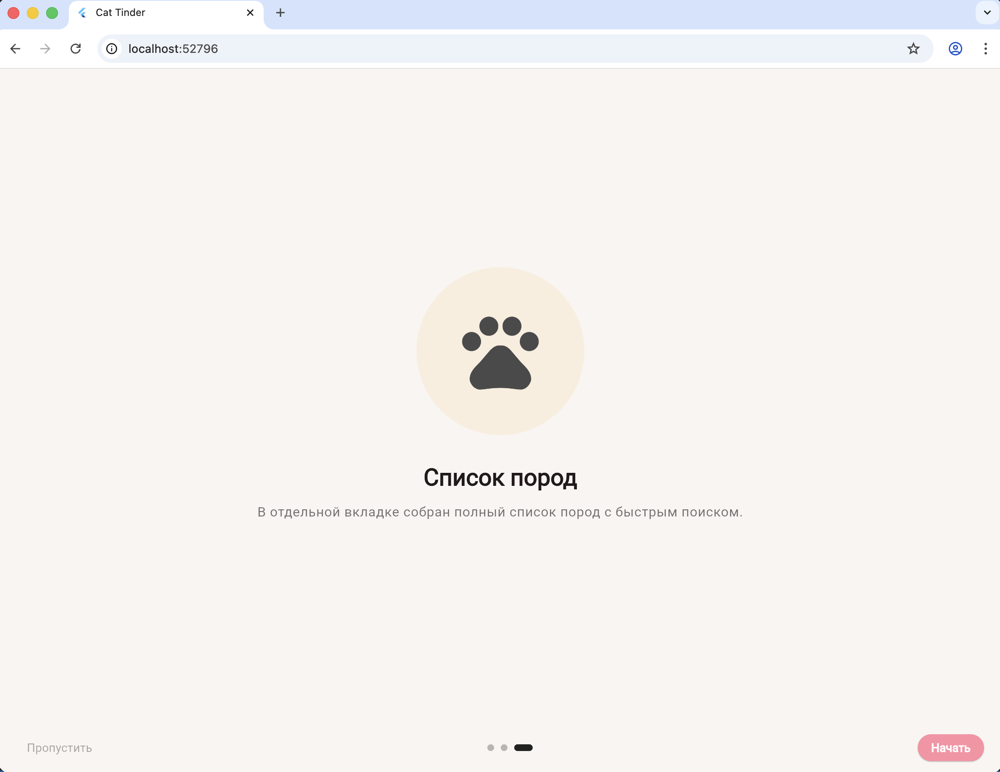
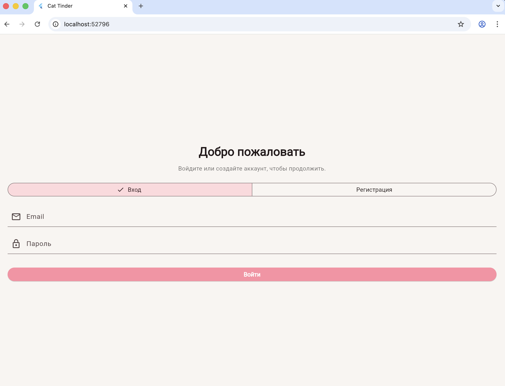

# Кототиндер Про

Мобильное приложение на Flutter: свайпы котиков, карточки пород, онбординг и полноценный флоу регистрации/входа. Данные о котиках берутся из TheCatAPI.

## Реализованные фичи (включая ДЗ-2)
- Онбординг с горизонтальным скроллом и анимацией котика, объясняющий ключевые сценарии.
- Регистрация и вход с валидацией, сохранением сессии и локальным хранением пароля в Keychain/Keystore через `flutter_secure_storage`.
- Сохранение статуса авторизации и прохождения онбординга между запусками.
- Главный экран со свайпами/лайк-дизлайк и счётчиком понравившихся.
- Детальная карточка котика с данными породы.
- Вкладка «Список пород» с деталями каждой породы.
- Логирование событий регистрации/входа в AppMetrica.

## Архитектура
Проект переработан в слоистую структуру в духе clean architecture:
- `Data`: источники данных и реализации репозиториев.
- `Domain`: сущности, интерфейсы репозиториев, use-cases и валидаторы.
- `Presentation`: экраны, контроллеры состояния, тема.

Зависимости собираются централизованно в `AppDependencies` и прокидываются через DI.

## Скриншоты
Онбординг:




Регистрация / вход:



## APK (релиз)
- Ссылка для скачивания: `https://github.com/Gayana5/kototinder/releases/download/v1.0.0/app-release.apk`

Собрать APK локально:
```bash
flutter build apk --release \
  --dart-define=THE_CAT_API_KEY=YOUR_CAT_API_KEY \
  --dart-define=APPMETRICA_API_KEY=YOUR_APPMETRICA_KEY
```
После сборки положите файл `app-release.apk` в `assets/readme/` и обновите ссылку выше, если путь отличается.

## API ключи
В коде нет явных API-ключей. Используются переменные компиляции:
- `THE_CAT_API_KEY` — ключ TheCatAPI (опционально).
- `APPMETRICA_API_KEY` — ключ AppMetrica для аналитики.

## Запуск и разработка
1. `flutter pub get`
2. `flutter run --dart-define=THE_CAT_API_KEY=YOUR_CAT_API_KEY --dart-define=APPMETRICA_API_KEY=YOUR_APPMETRICA_KEY`
3. `flutter analyze`
4. `flutter test`

## CI/CD
В `.github/workflows/flutter_ci.yml` настроен пайплайн:
- `flutter analyze`
- `flutter test` (unit + widget)

Пайплайн падает при ошибках.

## Стек
- Flutter 3, Material 3, кастомная тема
- `http`, `cached_network_image`
- `provider`, `shared_preferences`, `flutter_secure_storage`
- `appmetrica_plugin` для аналитики
- `flutter_test`, `mocktail`
